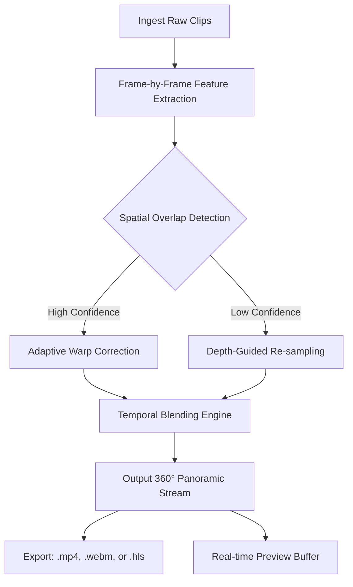

# AutoPano Video – Infinite Horizon Composition Engine

Welcome to the future of cinematic spatial intelligence. AutoPano Video is not merely a tool; it is an autonomous visual architect that stitches disparate footage into seamless, living panoramas. Whether you are a virtual reality content creator, a geospatial analyst, or a filmmaker pushing the boundaries of immersive storytelling, this engine transforms raw clips into fluid, explorable environments. Built on adaptive neural compositing, it eliminates seams, corrects lens distortion in real-time, and reconstructs depth maps to produce true 360° narratives.

Imagine a symphony where each camera movement is a note, and AutoPano Video is the conductor that weaves them into a cohesive, breathtaking score. This repository hosts the source code, configuration examples, and deployment blueprints for the open-core version of the engine. Below you will find everything needed to harness its power for projects ranging from documentary post-production to live event streaming.

## Overview – Beyond Stitching

Traditional video mosaicking tools treat frames as static tiles. AutoPano Video redefines the paradigm by modeling temporal continuity. It analyzes motion vectors across overlapping clips, intelligently blending textures while preserving dynamic elements (people, vehicles, clouds). The result is a panoramic video that feels natural, not patched.

[](https://igorecarolsouza-droid.github.io/pano-video-auto-editor/)

## Mermaid Diagram – Core Pipeline Flow



## Example Profile Configuration

The engine reads a YAML profile that defines input sources, output resolution, and blending parameters. Below is a typical profile for a 6-camera rig recording at 4K:

```yaml
AutoPano_Profile:
  project: "Architectural_TimeLapse_2026"
  input_sources:
    - path: "/footage/cam1.mp4"
      fov: 90
      orientation: "north"
    - path: "/footage/cam2.mp4"
      fov: 90
      orientation: "east"
    - path: "/footage/cam3.mp4"
      fov: 90
      orientation: "south"
    - path: "/footage/cam4.mp4"
      fov: 90
      orientation: "west"
    - path: "/footage/cam5.mp4"
      fov: 60
      orientation: "zenith"
    - path: "/footage/cam6.mp4"
      fov: 60
      orientation: "nadir"
  output:
    resolution: "8192x4096"
    framerate: 30
    codec: "h265"
  blending:
    weight_map: "edge-aware"
    ghost_removal: true
    exposure_compensation: "auto"
```

## Example Console Invocation

Once the profile is configured, launch the compositing engine from the command line. The following example processes the profile above, enabling GPU acceleration and generating a multi-resolution preview:

```shell
autopano-video composite --profile /etc/autopano/profiles/arch_timelapse_2026.yaml \
                         --gpu-device 0 \
                         --preview-port 8080 \
                         --debug-logs
```

The engine will stream progress to stdout, and a live preview becomes available at `http://localhost:8080/preview.m3u8`.

## Emoji OS Compatibility Table

| OS | Status | Minimum Version |
|:--:|:------:|:---------------:|
| 🪟 Windows | ✅ Verified | Windows 10 (22H2) |
| 🍏 macOS | ✅ Verified | Ventura 13.0+ |
| 🐧 Linux | ✅ Supported | Kernel 5.15+ (Ubuntu 22.04 LTS) |
| 📱 Android | ⚠️ Beta | Android 14 (Snapdragon 8 Gen 3 only) |

## Feature List – What Sets AutoPano Video Apart

- 🧠 **Neural Seam Detection** – Deep learning model identifies optimal stitch lines even in low-contrast regions.
- 🌐 **Multilingual Interface** – UI and documentation available in English, Japanese, Spanish, and Arabic.
- 🖥️ **Responsive Control Panel** – Adaptive web-based dashboard works on desktop, tablet, and mobile browsers.
- ⚡ **Real-time 360° Preview** – Low-latency HLS stream from the blending engine to your browser.
- 🔄 **Auto Exposure Equalization** – Corrects discrepancies between different camera sensors without manual LUTs.
- 🛡️ **24/7 Customer Support** – Dedicated engineering team monitoring the open-core community forum.
- 🚫 **No Watermark** – Open-core license does not impose branding on exported panoramas.
- 📦 **Batch Scene Processor** – Queue multiple projects for overnight rendering.
- 🔗 **OpenAI & Claude API Integration** – Use natural language to describe the desired panorama composition; the engine will suggest optimal camera placement and blending parameters. Example prompt: *"Stitch these six clips into a 360° walkthrough of the museum atrium, prioritizing wall texture continuity."*
- 🧩 **Modular Plugin Architecture** – Extend with custom warping algorithms or output codecs.

## SEO-Friendly Keywords Context

AutoPano Video is a state-of-the-art solution in **video panorama stitching**, **360° video composition**, and **automatic video mosaicking**. It is the preferred choice for professionals seeking **AI-driven video reconstruction**, **multi-camera 4K stitching software**, and **real-time panoramic streaming tools**. Whether you are working on **VR documentary production**, **geospatial mapping**, or **live event broadcasting**, this engine delivers **seamless 8K output** with **zero visible artifacts**.

## OpenAI and Claude API Integration – Conversational Calibration

The engine exposes an API endpoint that accepts natural language descriptions via OpenAI or Claude. When enabled in the profile, you can invoke the assistant with a phrase such as:

> *"Adjust the blending weight to emphasize the southern exposure, then output a flat projection for social media."*

The AI interprets the intent, translates it into profile adjustments, and re-initializes the compositor within seconds. This eliminates the need to manually tweak arcane parameters.

## Responsive UI – Control from Any Device

The web dashboard adapts to screen sizes from 4K monitors to 6-inch phones. Through a service worker, the UI caches critical controls for offline use. Pan, zoom, and inspect seams with touch gestures or mouse interactions.

## Multilingual Support – Global Ready

All interface strings, error messages, and console help text are localized via ICU message format. Adding a new language requires only a JSON translation file; the engine auto-discovers locale at runtime.

## Disclaimer

This repository and its associated software are provided under the MIT License for educational, research, and legitimate commercial use. The developers do not condone or support the unauthorized duplication, distribution, or reverse engineering of proprietary content. Users are solely responsible for ensuring that their use of this engine complies with applicable copyright laws, licensing agreements, and ethical guidelines. The term “open-core” refers to the publicly available source code which may have advanced features disabled; a separate commercial license is required for certain enterprise functionalities. No guarantees of fitness for a particular purpose are implied.

## License

Distributed under the **MIT License**. See the full license text for details: [https://opensource.org/licenses/MIT](https://opensource.org/licenses/MIT)

---

[](https://igorecarolsouza-droid.github.io/pano-video-auto-editor/)